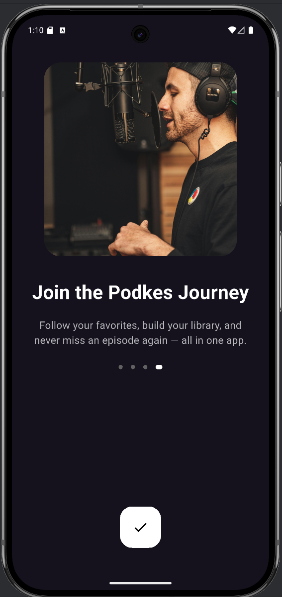
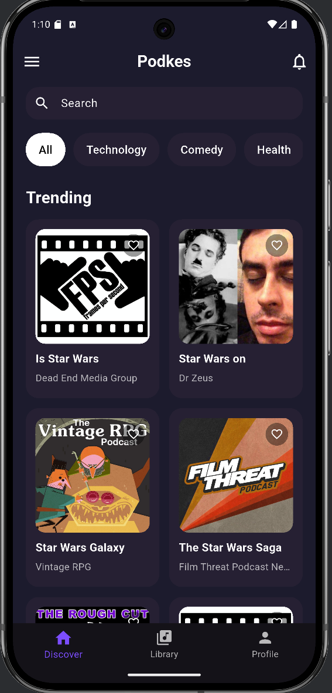
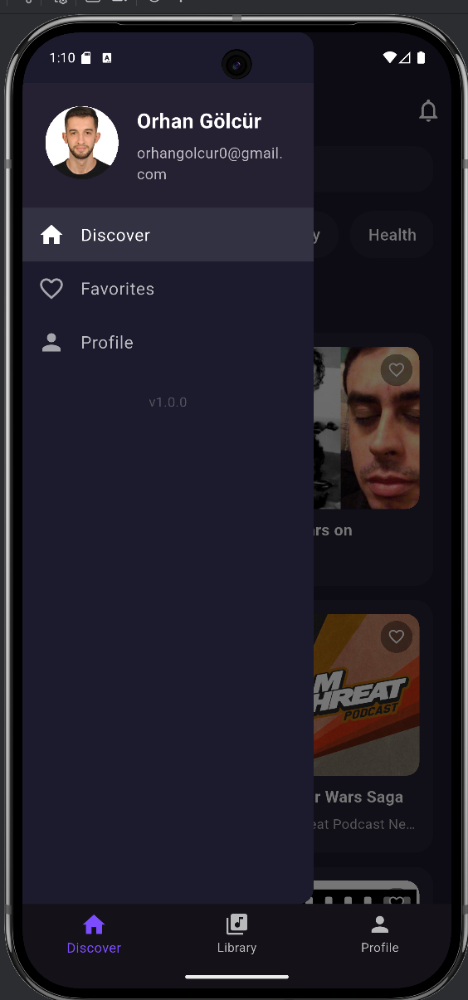
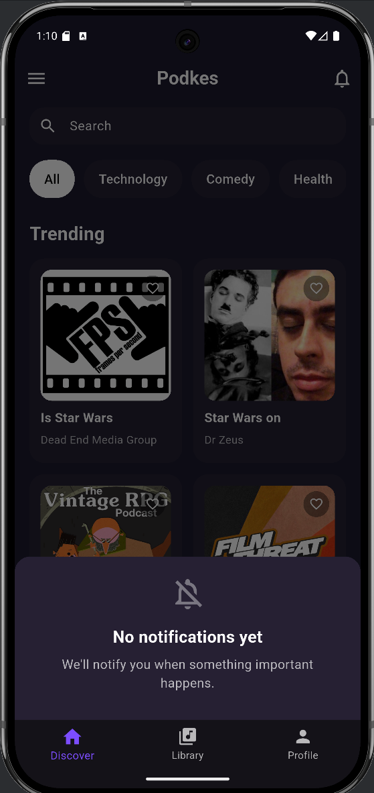
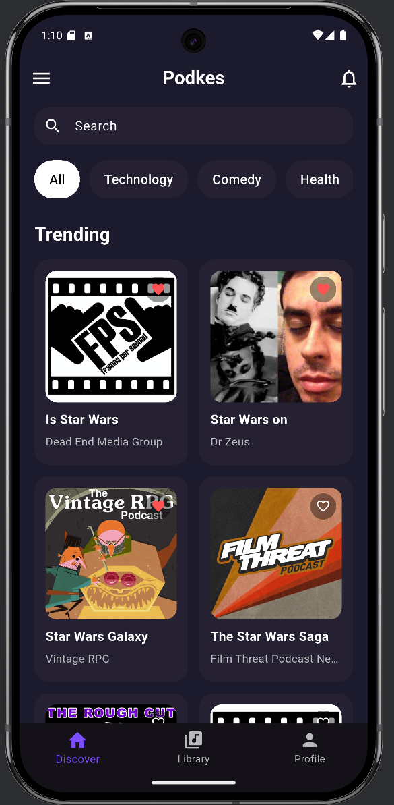
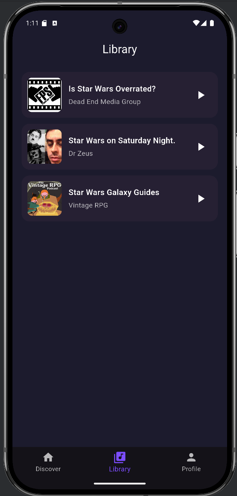
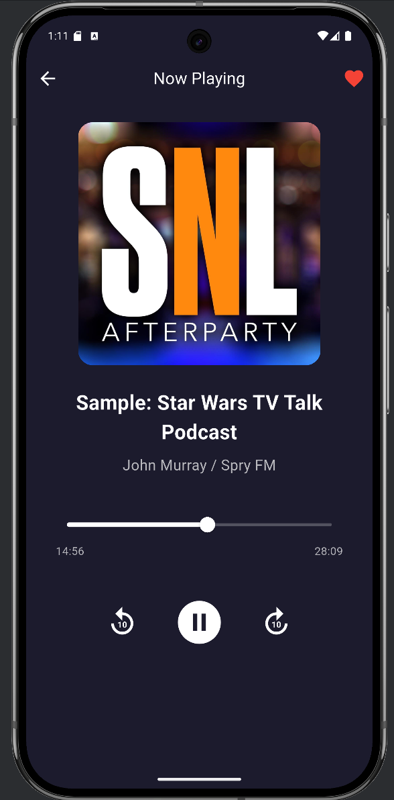
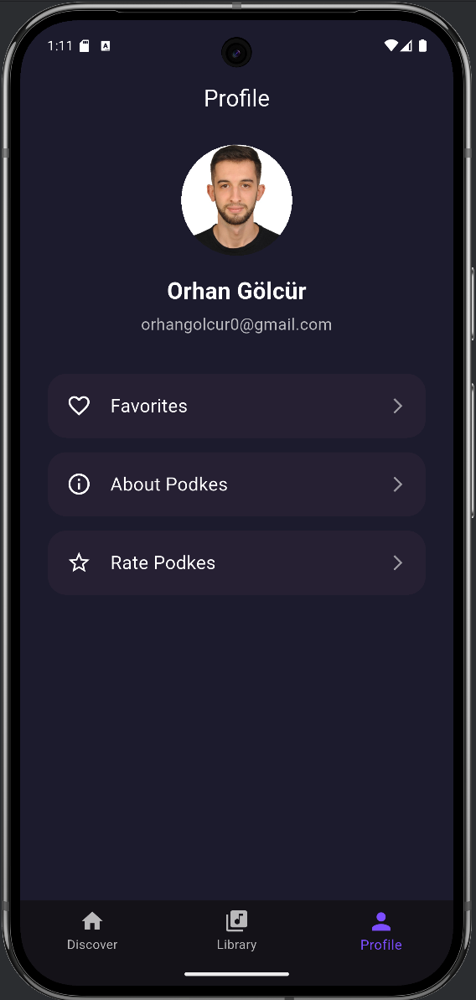
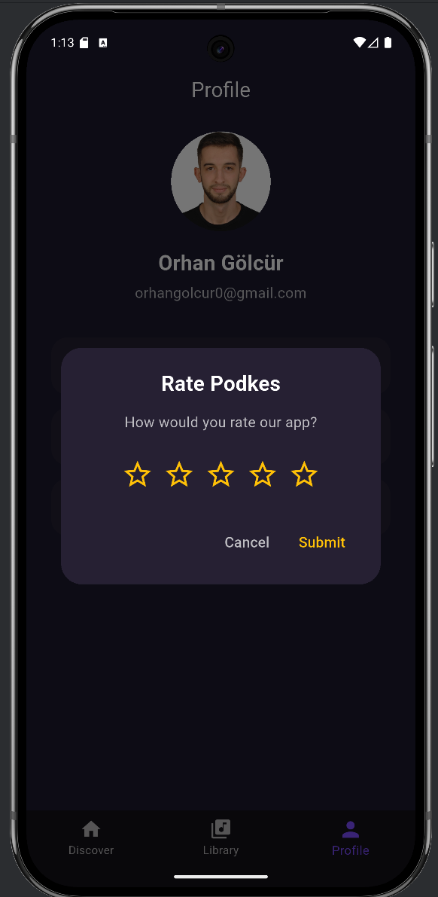
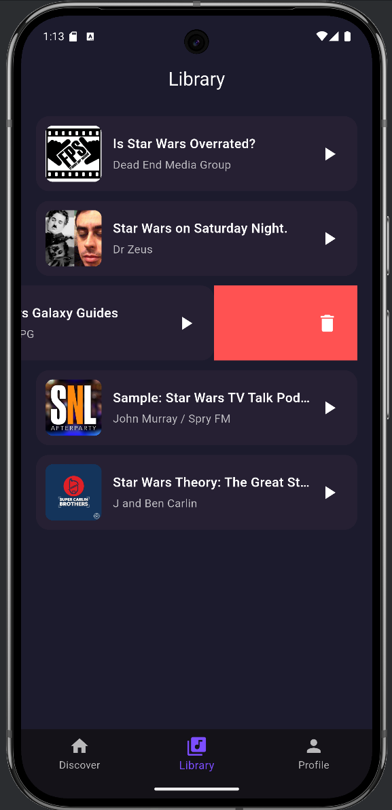

# Podkes App

**Podkes**, kullanıcıların podcast yayınlarını kolayca keşfedebileceği, dinleyebileceği ve favorilerine ekleyebileceği şık bir Flutter uygulamasıdır. Kullanıcı arayüzü modern ve sezgiseldir, veri yönetimi ise BLoC (Cubit) mimarisiyle sağlanmıştır. Gerçek podcast verileri ile çalışır ve kategori bazlı filtreleme sunar.

---

## 📸 Ekran Görüntüleri

<p align="center">
  
  
  
</p>

<p align="center">
  
  
  
</p>

<p align="center">
  
  
  
</p>

<p align="center">
  
  
  
</p>


---

## 🚀 Özellikler

- 🎙️ Podcast’leri kategorilere göre keşfetme
- 🔍 Arama çubuğu ile içerik bulma
- ❤️ Favorilere ekleme
- 🎧 Tam ekran oynatıcı (ileri-geri sarma, durdurma)
- 📁 Kişisel kütüphane
- 👤 Kullanıcı profili ve drawer menüsü
- 🌙 Karanlık mod
- ⭐ Uygulama puanlama popup’ı
- 🔔 Bildirim kontrol ekranı
- 🧭 Bottom navigation ve responsive yapı

---

## 🧰 Kullanılan Teknolojiler

| Teknoloji | Açıklama |
|----------|----------|
| Flutter  | Uygulama geliştirme framework'ü |
| Dart     | Programlama dili |
| Bloc/Cubit | State yönetimi |
| GoRouter | Sayfa yönlendirme |
| Flutter Rating Bar | Puanlama popup’ı için |

---

## 🗂️ Proje Yapısı

```text
lib/
├── core/
│   ├── config/
│   ├── network/
│   ├── router/
│   └── widgets/
├── features/
│   ├── discover/
│   ├── favorites/
│   ├── now_playing/
│   ├── onboarding/
│   └── profile/
├── my_app.dart
├── podkes_app.dart
└── main.dart
```

---

## 🛠️ Kurulum

Projeyi çalıştırmak için:

```bash
flutter pub get
flutter run
```

> Android Studio veya VS Code önerilir.

---

## 🧪 Test

```bash
flutter test
```

---

## 👤 Geliştirici

- **Ad:** Orhan Gölcür  
- **E-posta:** orhangolcur0@gmail.com  
- **GitHub:** [github.com/orhangolcur](https://github.com/orhangolcur)

---

## 📄 Lisans

Bu proje sadece eğitim ve değerlendirme amacıyla geliştirilmiştir.
